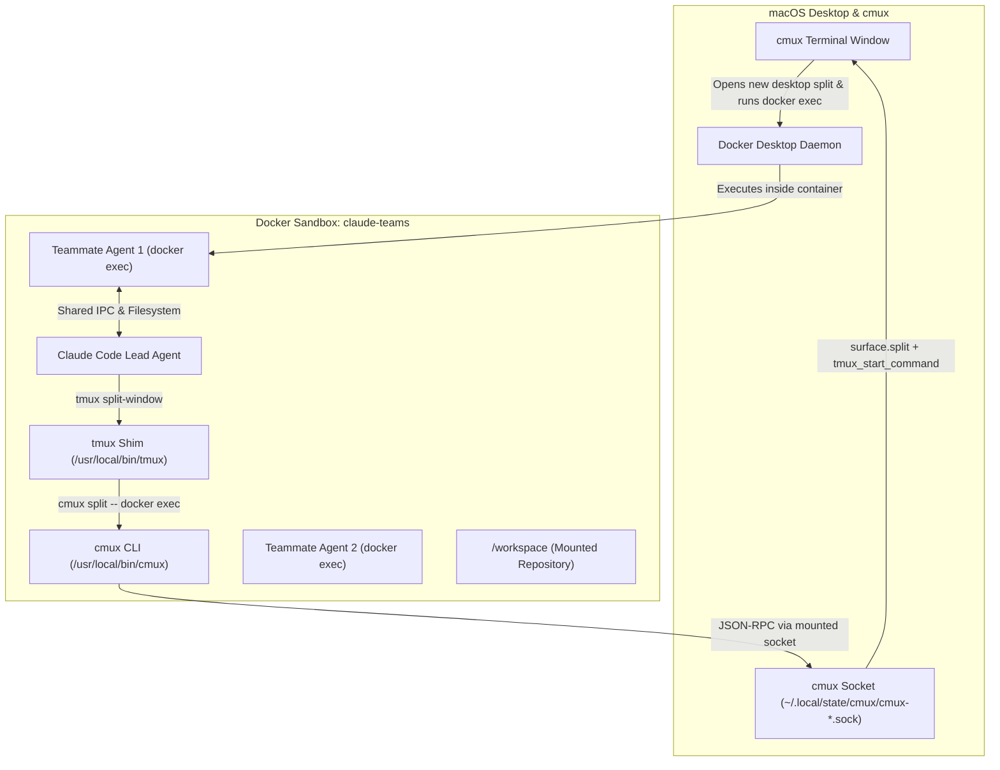

# Sandboxed Claude Code Agent Teams in Docker + cmux

Run **Claude Code Agent Teams** inside an isolated Docker sandbox container while projecting teammate agents into native **[cmux](https://cmux.com)** desktop split panes and windows.

All agent processes execute inside a **single container** to share IPC, network, and workspace filesystems, while providing the developer with an interactive, multi-pane desktop terminal experience.

---

## Architecture Overview



### Key Highlights
1. **Container Isolation**: Claude Code and its teammates run entirely inside Docker. Commands and file modifications are restricted to the sandbox.
2. **Shared Agent IPC**: Because teammates are launched via `docker exec` against the same container (`claude-teams`), all agent communication, locks, and temporary files remain shared and synchronized.
3. **Native Desktop Splitting**: Rather than trapping agent sessions inside a headless virtual tmux session, `cmux` opens interactive native terminal panes on macOS.

---

## File Structure

| File | Description |
| :--- | :--- |
| [`Dockerfile`](./Dockerfile) | Debian Bookworm (`node:22-bookworm-slim`) base image running as non-root `node` user with passwordless `sudo`, `docker-ce-cli`, `git`, `procps`, `@anthropic-ai/claude-code`, container `cmux` CLI, and `tmux-cmux-shim.sh`. |
| [`entrypoint.sh`](./entrypoint.sh) | Container entrypoint ensuring read/write access to mounted cmux/Docker sockets and initializing persistent user configs. |
| [`cmux`](./cmux) | Lightweight, dependency-free Node.js CLI client inside the container that communicates with the host cmux socket, wrapping calls in the active `_cmux_capability_v1` authorization envelope. |
| [`tmux-cmux-shim.sh`](./tmux-cmux-shim.sh) | Installed at `/usr/local/bin/tmux`. Intercepts `split-window`, `new-window`, `display-message`, and `list-panes`, translating them to `cmux split -- "docker exec -u node -it <container> <cmd>"`. |
| [`docker-compose.yml`](./docker-compose.yml) | Service definition mounting the workspace, persistent Claude auth volume (`/home/node/.claude`), Docker socket, and host cmux socket. |
| [`run-teams.sh`](./run-teams.sh) | Launcher script that auto-detects the host cmux socket and active capability token, builds/starts the container, and attaches Claude Code with `--dangerously-skip-permissions --teammate-mode auto`. |

---

## Prerequisites

1. **Docker Desktop** (or Docker Engine with Unix socket enabled).
2. **[cmux](https://cmux.com)** installed and running on macOS.

---

## Getting Started

### 1. Launch Agent Teams

From a terminal (inside cmux or any terminal on the host):

```bash
cd /path/to/claude-docker-container
./run-teams.sh
```

You can pass extra flags directly to Claude Code:

```bash
./run-teams.sh --model sonnet
```

### 2. What Happens Next

1. `run-teams.sh` detects the active cmux control socket (e.g. `~/.local/state/cmux/cmux-501.sock`) and exports the active socket capability token.
2. The `claude-teams` container is built and started in the background.
3. Your terminal attaches to the container running `claude --teammate-mode auto`.
4. When Claude Code requests a teammate, the `tmux` shim intercepts `split-window` and requests a new pane from cmux.
5. cmux creates a native desktop split pane and runs `docker exec -it claude-teams <teammate-command>`.

---

## Testing & Verification

To verify that the container shim can split cmux desktop panes in isolation without launching Claude:

```bash
# Ensure container is running
docker compose up -d

# Trigger a test split from inside the container
docker compose exec -T claude-teams tmux split-window -h echo "Teammate ready"
```

A new native pane will appear in cmux running the command inside the container.

---

## Configuration & Environment Variables

| Variable | Scope | Purpose |
| :--- | :--- | :--- |
| `HOST_CMUX_SOCK` | Host | Path to the active cmux socket on the host. |
| `CMUX_SOCKET_PATH` | Container | Path to the mounted cmux socket inside the container (`/var/run/cmux.sock`). |
| `CMUX_SOCKET_CAPABILITY` | Host / Container | Authentication capability token exported by cmux terminal sessions. |
| `CLAUDE_CODE_EXPERIMENTAL_AGENT_TEAMS` | Container | Set to `1` to enable Claude Code's multi-agent team features. |
| `TMUX` | Container | Set to `/tmp/fake-tmux-sock,0,0` so Claude detects an active multiplexer environment. |
| `CONTAINER_NAME` | Container | Target container name for `docker exec` teammate commands (default: `claude-teams`). |

---

## Technical Insights & Troubleshooting Reference

Key architectural details and lessons learned during implementation:

### 1. Claude Code Agent Teams Two-Phase Spawning
Claude Code spawns teammates in two distinct steps:
1. **Placeholder Split (`split-window ... cat`)**: Claude first runs `split-window` with `cat` to allocate a pane ID (`%1`, `%2`, etc.) and wait.
2. **Inbox Population**: Claude writes the teammate's task instructions to `~/.claude/teams/<session>/inboxes/<agent>.json`.
3. **Execution (`respawn-pane -k -t %N -- <command>`)**: Claude replaces the placeholder process with the actual teammate agent command.
- **Solution in Shim**: `tmux-cmux-shim.sh` creates a runner `/tmp/teammate_runner_${ID}.sh` that polls for `/tmp/teammate_cmd_${ID}`, ensuring that `respawn-pane` seamlessly delivers the command to the already-open `cmux` desktop split without race conditions.

### 2. Interactive TTY Preservation (The `--print` Gotcha)
- Claude Code teammate processes **require an interactive TTY** to initialize their full-screen Ink UI and internal message polling.
- Pipelining teammate commands to `tee` (e.g. `bash -c "$CMD" 2>&1 | tee log`) makes `stdout.isTTY = false`.
- When stdout is not a TTY, Claude Code automatically switches into non-interactive pipe filter mode (`--print`). Because teammate agents do not receive prompts via CLI arguments, Claude immediately exits with:
  ```text
  Error: Input must be provided either through stdin or as a prompt argument when using --print
  ```
- **Rule**: Teammate runner scripts must invoke commands directly (`eval "$CMD"`) without output redirection pipes.

### 3. cmux Split & Command Injection via `surface.send_text`
- The `surface.split` JSON-RPC method creates a new terminal pane on macOS, but initial input parameters (`initial_input` or `tmux_start_command`) can be flushed during the host shell's `.zshrc` boot sequence (`tcflush`).
- cmux's native `--command` relies on optional shell integration hooks (`CMUX_SHELL_INTEGRATION_DIR`), which may not be loaded in a default shell.
- **Reliable Dispatch Pattern**:
  1. Dispatch `surface.split` to obtain the new `surface_id`.
  2. Wait 600 ms for macOS `zsh` to finish loading environment and prompt.
  3. Send the execution string (`docker exec -u node -it claude-teams ...\n`) via `surface.send_text`.

### 4. Non-Root Execution & `--dangerously-skip-permissions`
- Claude Code (version 2.1+) enforces that `--dangerously-skip-permissions` cannot be used with root or sudo privileges (`process.getuid() === 0`).
- The sandbox container runs as the non-root `node` user (UID 1000) with passwordless `sudo` rights for administrative tasks.
- The entrypoint script (`entrypoint.sh`) ensures Unix sockets (`/var/run/cmux.sock`, `/var/run/docker.sock`) and `/tmp` have proper permissions (`chmod 666` / `chmod 1777`) so `node` has unrestricted communication with Docker and cmux.

### 5. Teammate Lifecycle & `kill-pane` Cleanup
- When a task completes or the user dismisses an agent, Claude Code sends `tmux kill-pane -t %N`.
- The runner logs its PID to `/tmp/teammate_pid_${ID}`, allowing the shim's `kill-pane` handler to cleanly terminate the teammate process and remove temporary coordination files.

