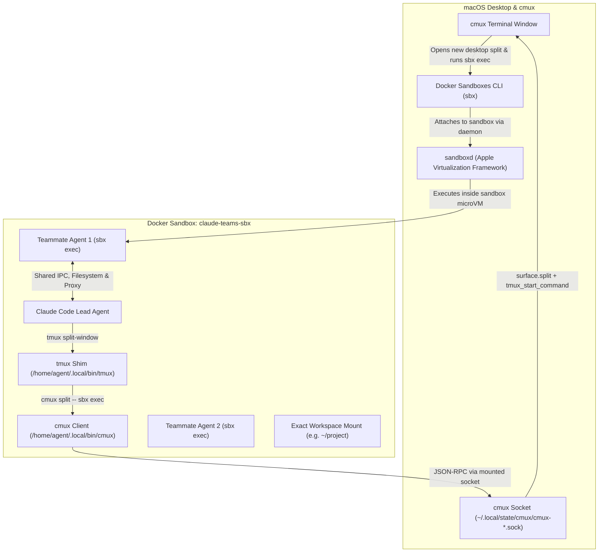

# Claude Code Agent Teams in Docker Sandboxes (`sbx`) + cmux

Run **Claude Code Agent Teams** inside an isolated **Docker Sandbox microVM (`sbx`)** while projecting teammate agents into native **[cmux](https://cmux.com)** desktop split panes and windows on macOS.

---

## Architecture Overview



---

## Comparison: Docker Compose vs. Docker Sandboxes (`sbx`)

| Feature | Docker Compose (`claude-docker-container`) | Docker Sandboxes `sbx` (`claude-docker-sandbox`) |
| :--- | :--- | :--- |
| **Isolation Level** | Linux container namespaces & cgroups inside Docker Desktop VM | Dedicated **Apple Virtualization microVM** per sandbox managed by `sandboxd` |
| **Workspace Paths** | Remapped to fixed path (e.g. `/workspace`) | **Identical host path parity** (mounted at the exact same host path) |
| **Authentication & Secrets** | Stored in env files or mounted host files | **Built-in OAuth & Secret Manager** via `sbx secret` and proxy injection |
| **Teammate Execution** | `docker exec -it claude-teams ...` | `sbx exec -it -w <workdir> claude-teams-sbx ...` |
| **Egress Security** | Open Docker bridge network | Controlled **network proxy** (`gateway.docker.internal:3128`) with domain allowlists |
| **Configuration** | `docker-compose.yml` + `Dockerfile` | Declarative `sbxenv.yaml` or CLI `sbx create` / `sbx run` |
| **Claude Code Binary** | Bundled inside custom image build | Pre-baked official Docker Sandbox template (`docker/sandbox-templates:claude-code`) |

---

## Files in this Directory

- [`run-teams.sh`](./claude-docker-sandbox/run-teams.sh): Helper script that detects active host `cmux` socket, creates the `sbx` sandbox, configures the `tmux` shim, and attaches Claude Code in Agent Teams mode.
- [`tmux-cmux-shim.sh`](./claude-docker-sandbox/tmux-cmux-shim.sh): Emulates tmux commands (`split-window`, `new-window`, `list-panes`, etc.) and dispatches splits via `cmux split -- sbx exec -it claude-teams-sbx <cmd>`.
- [`cmux`](./claude-docker-sandbox/cmux): Lightweight Node.js CLI client with dynamic socket discovery that connects to the mounted cmux socket and sends JSON-RPC requests.
- [`sbxenv.yaml`](./claude-docker-sandbox/sbxenv.yaml): Declarative configuration for Docker Sandboxes (`sbx env plan` and `sbx env run`).
- [`Dockerfile`](./claude-docker-sandbox/Dockerfile): Alternative Dockerfile for manual builds.
- [`docker-compose.yml`](./claude-docker-sandbox/docker-compose.yml): Compose reference definition.

---

## How to Run

### 1. Launch Claude Code Agent Teams
From your terminal inside this directory:
```bash
cd /path/to/claude-docker-sandbox
./run-teams.sh
```

### 2. Verify Setup Without Attaching
You can test the socket connection and shim without launching Claude:
```bash
./run-teams.sh --test
```

### 3. Stop or Clean Up the Sandbox
To stop the running sandbox:
```bash
./run-teams.sh --stop
```

To stop and permanently remove the sandbox:
```bash
./run-teams.sh --down
```

### 4. Declarative Usage via `sbxenv.yaml`
Inspect the environment plan:
```bash
sbx env plan ./sbxenv.yaml
```

Run the declarative environment:
```bash
sbx env run ./sbxenv.yaml
```

---

## Technical Insights & Troubleshooting Reference

Key architectural details and lessons learned during implementation:

### 1. Claude Code Agent Teams Two-Phase Spawning
Claude Code spawns teammates in two distinct steps:
1. **Placeholder Split (`split-window ... cat`)**: Claude first runs `split-window` with `cat` to allocate a pane ID (`%1`, `%2`, etc.) and wait.
2. **Inbox Population**: Claude writes the teammate's task instructions to `~/.claude/teams/<session>/inboxes/<agent>.json`.
3. **Execution (`respawn-pane -k -t %N -- <command>`)**: Claude replaces the placeholder process with the actual teammate agent command.
- **Solution in Shim**: `tmux-cmux-shim.sh` creates a runner `/tmp/teammate_runner_${ID}.sh` that polls for `/tmp/teammate_cmd_${ID}`, ensuring that `respawn-pane` seamlessly delivers the command to the already-open `cmux` desktop split without race conditions.

### 2. Interactive TTY Preservation (The `--print` Gotcha)
- Claude Code teammate processes **require an interactive TTY** to initialize their full-screen Ink UI and internal message polling.
- Pipelining teammate commands to `tee` (e.g. `bash -c "$CMD" 2>&1 | tee log`) makes `stdout.isTTY = false`.
- When stdout is not a TTY, Claude Code automatically switches into non-interactive pipe filter mode (`--print`). Because teammate agents do not receive prompts via CLI arguments, Claude immediately exits with:
  ```text
  Error: Input must be provided either through stdin or as a prompt argument when using --print
  ```
- **Rule**: Teammate runner scripts must invoke commands directly (`eval "$CMD"`) without output redirection pipes.

### 3. cmux Split & Command Injection via `surface.send_text`
- The `surface.split` JSON-RPC method creates a new terminal pane on macOS, but initial input parameters (`initial_input` or `tmux_start_command`) can be flushed during the host shell's `.zshrc` boot sequence (`tcflush`).
- cmux's native `--command` relies on optional shell integration hooks (`CMUX_SHELL_INTEGRATION_DIR`), which may not be loaded in a default shell.
- **Reliable Dispatch Pattern**:
  1. Dispatch `surface.split` to obtain the new `surface_id`.
  2. Wait 600 ms for macOS `zsh` to finish loading environment and prompt.
  3. Send the execution string (`sbx exec -w ... -it claude-teams-sbx ...\n`) via `surface.send_text`.

### 4. Container Permissions & Host UID Mapping in `sbx`
- Apple Virtualization Framework mounts and `sbx cp` create files inside the microVM with the host UID (`501`).
- The in-container non-root user `agent` is UID `1000`.
- Shim scripts installed to `/home/agent/.local/bin/` must be installed with `sbx exec -u root` and explicitly chowned to `agent:agent` (`chmod +x`) to prevent `Permission denied` during subsequent container runs.

### 5. Teammate Lifecycle & `kill-pane` Cleanup
- When a task completes or the user dismisses an agent, Claude Code sends `tmux kill-pane -t %N`.
- The runner logs its PID to `/tmp/teammate_pid_${ID}`, allowing the shim's `kill-pane` handler to cleanly terminate the teammate process and remove temporary coordination files.
